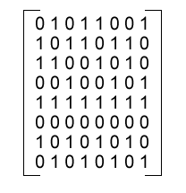

# &lt;del&gt;<del>憋</del>&lt;/del&gt;考死牛

>总结了古今中外一些“优秀”面试题的精髓，希望对大家的面试有帮助。

-------------

>真实目的：立志考倒各种资深前端、架构师、专家，为博大家一乐，不要当真，呵呵~

>面试题总分100分，初始分值100分，请谨慎作答。

##一般问题

1.  你用 Twitter ，Facebook 吗，都关注哪些人？

    参考答案：
    不用，登不上去啊（作为资深前端，不会翻墙可不行 -1分）
    用，关注苍老师，**萝拉，吉泽**等娱乐明星，同时关注 Nicholas C. Zakas，Douglas Crockford，John Resig 等技术大牛。（诚实可信，不扣分）    
2.  使用过那些版本管理工具，说出几种名字？

    参考答案：
    CVS，TortoiseSVN，Git 等，发音准确就算过，不扣分
    参考 http://coolshell.cn/articles/3288.html     
3.  用过哪些编码工具（IDE），最喜欢哪一种？TAB 键是怎么设置的，1个空格，2个空格，还是4个空格？

    参考答案：自由回答
4.  平时用什么牌子电脑？ThinkPad，Mac 还是其它？

    参考答案：考官根据自己的电脑档次和面试者的电脑档次酌情给分。   
5.  平时喜欢用什么浏览器开发调试，简单说一下各浏览器的市场份额吧？

    参考答案：google 一下最新市场份额

6.  你能描述一下设计，制作，调试，发布一个网页的简单工作流程吗？

    参考答案：要求太高了吧...

7.  你能描述一下“渐进增强”和“优雅降级”用英文怎么写吗?

    参考答案：有道词典翻译，如果提到了“特性检测”，同时问“特性检测”英文怎么写。

8.  跟产品经理和其它合作人员的关系怎样？

    参考答案：没打过他们...（打过产品经理的 -10 分）

##HTML 相关问题

1.  完整写出几种常用的 DOCTYPE？    
    比如：
    <pre><code>&lt;!DOCTYPE html PUBLIC "-//W3C//DTD XHTML 1.0 Transitional//EN" "http://www.w3.org/TR/xhtml1/DTD/xhtml1-transitional.dtd"&gt;
    </code></pre>

    参考答案：（平时都是复制粘贴或自动生成的吧？哈哈）答不上来不扣分

2.  了解 HTML5 吗，请说一下 HTML5 以及之前的 HTML 的变迁史？

    参考答案：每本技术书前面都有好几章介绍历史（说不上来 -1 分）

3.  HTML5 更注重语义化，请说说 HTML5 总共增加了哪些标签，及其语义。

    参考答案：答不全 -1 分

4.  写一个最简洁，最兼容的 HTML 结构。

    参考答案：<html></html>

##CSS 相关问题

1.  你用过几种 IE，如何兼容 IE 5.5 及以下版本？

    参考答案：擦，直接减分吧......

##JavaScript 相关问题

1.  你使用过哪些 JavaScript 库，它们的作者是谁？

    参考答案：不会 -1 分

2.  请描述下 JavaScript 与 JAVA 的区别，为什么前端工程师得会 JAVA？

    参考答案：

3.  跟女友约会的时候会不会“面向对象”编程？

    参考答案：会（-10 分）

4.  谈一下你了解的设计模式，平常喜欢玩哪种模式，新手模式，普通模式，困难模式，还是专家模式？

    参考答案：地狱模式（1条命，死了重玩啊......）

5.  矩阵问题：3秒内说出矩阵内有多少个0，多少个1？
    
    

6.  你都使用哪些工具测试代码的性能？

    参考答案：催着上线，用户反馈测试吧（有时候也挨骂...）

##综合题

1.  请说出 N 种降低页面加载时间的方法。

    参考答案：N 可以等于1（说10种以上 -1 分）

2.  用 JavaScript，CSS，HTML 等所学的前端知识，描述一下氢气加氧气生成水的过程。
    参考公式：H2 + O2 = H2O

    参考答案：用 HTML 语义写出 H2 + O2 = H2O，再加点 CSS3 动画。（不会 -1 分）

3.  请写一个简单的幻灯片效果。

    参考答案：如果不使用 JS 完成，可以加 10 分；不用 JS 和 CSS 完成，加 20 分；不用 JS，CSS，HTML 完成加 100 分。

4.  浅析下“响应式设计”与“不响应设计”。

    参考答案：“不响应设计”是因为 JavaScript 被禁用了。

###总结
......做题结束，得了100分，以为面试妥妥的了，“回去等消息吧”（面试还是讲究眼缘，讲究彼此感觉，跟找对象类似...）

------------------------------------

**正经的面试参考：**    
[Front-end Job Interview Questions](https://github.com/darcyclarke/Front-end-Developer-Interview-Questions "Front-end Job Interview Questions")
